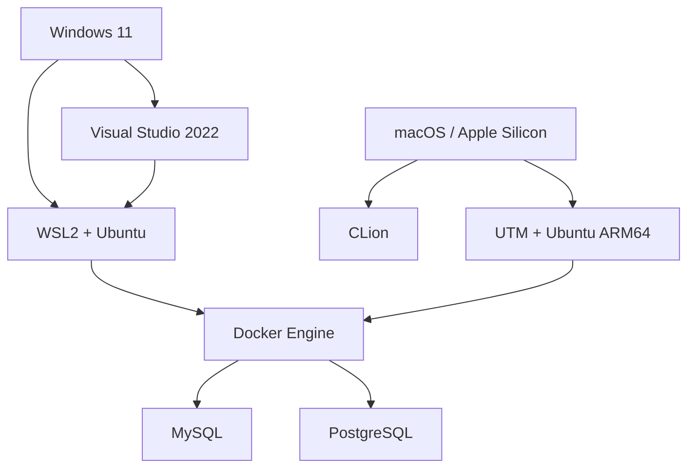

# MLSecDevOps — настройка среды разработки

## Содержание

### Windows

1. [Установка WSL2](docs/01-wsl2-installation.md)
2. [Установка Visual Studio](docs/02-visual-studio-installation.md)
3. [Интеграция Visual Studio с WSL2](docs/03-visual-studio-wsl2.md)

### macOS (Apple Silicon)

4. [Установка CLion](docs/04-clion-macos.md)
5. [Установка Linux VM в UTM](docs/05-linux-vm-macos.md)

### Linux: WSL2 или VM

6. [Установка Docker Engine и Compose](docs/06-docker-linux.md)
7. [Запуск MySQL в Docker](docs/07-mysql-docker.md)
8. [Запуск PostgreSQL в Docker](docs/08-postgresql-docker.md)

## Схема окружения



## Структура репозитория

```text
mlsecdevops-environment/
├── README.md
├── .gitignore
├── docs/
│   ├── 01-wsl2-installation.md
│   ├── 02-visual-studio-installation.md
│   ├── 03-visual-studio-wsl2.md
│   ├── 04-clion-macos.md
│   ├── 05-linux-vm-macos.md
│   ├── 06-docker-linux.md
│   ├── 07-mysql-docker.md
│   └── 08-postgresql-docker.md
├── docker/
│   ├── mysql/{compose.yaml,.env.example}
│   └── postgres/{compose.yaml,.env.example}
└── images/{wsl,visual-studio,visual-studio-wsl,clion,vm,docker,mysql,postgres}/
```

## Как пользоваться

1. Выберите документацию для своей ОС: Windows или macOS.
2. Выполняйте главы последовательно.
3. Перейдите к общей Linux-инструкции по Docker.
4. Запустите обе СУБД и выполните проверки из глав 7–8.

## Безопасность

- Не добавляйте `.env` и каталоги данных СУБД в Git.
- Заменяйте демонстрационные пароли перед реальным использованием.
- Публикация портов `3306` и `5430` рассчитана на учебную локальную машину. Не открывайте их в недоверенную сеть.
- Для воспроизводимой эксплуатации фиксируйте версии образов вместо `latest`.

