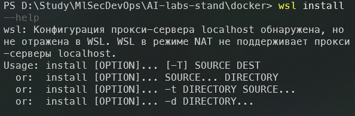
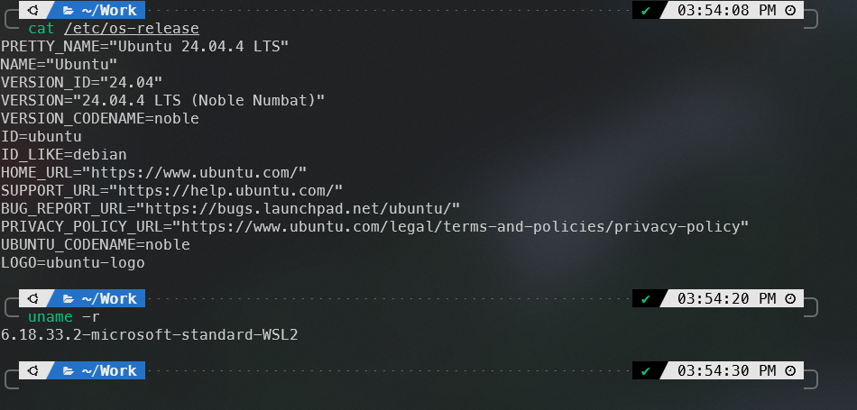

# 01. Установка WSL2 и Ubuntu в Windows

[← Содержание](../README.md) · [Следующая глава →](02-visual-studio-installation.md)

## Требования

- Windows 11 либо Windows 10 версии 2004 / сборки 19041 или новее;
- включённая аппаратная виртуализация.

Проверить версию Windows можно командой `winver`. Состояние виртуализации отображается в **Диспетчер задач → Производительность → ЦП**.

## 1. Установка

Откройте PowerShell или Windows Terminal **от имени администратора**:

```powershell
wsl --install
```

Команда включает необходимые компоненты, устанавливает WSL2 и Ubuntu по умолчанию. После завершения перезагрузите компьютер.

Если WSL уже установлен, посмотрите доступные дистрибутивы и явно установите Ubuntu:

```powershell
wsl --list --online
wsl --install -d Ubuntu
```

Если загрузка зависла на `0.0%`:

```powershell
wsl --install --web-download -d Ubuntu
```



## 2. Первоначальная настройка Ubuntu

После перезагрузки запустите **Ubuntu** из меню «Пуск». При первом запуске задайте имя Linux-пользователя и пароль. Пароль при вводе не отображается — это нормальное поведение Linux.

```bash
sudo apt update
sudo apt upgrade -y
```

## 3. Проверка

В PowerShell:

```powershell
wsl --status
wsl --list --verbose
```

```text
wsl.exe --status
Дистрибутив по умолчанию: Ubuntu-24.04
Версия по умолчанию: 2
```

В Ubuntu:

```bash
cat /etc/os-release
uname -m
```

На обычном Windows-ПК архитектура чаще всего `x86_64`.



## Возможные проблемы

- **WSL показывает справку вместо установки:** выполните `wsl --list --online`, затем `wsl --install -d Ubuntu`.
- **Ошибка виртуализации:** включите Intel VT-x/AMD-V в UEFI/BIOS и проверьте компонент Virtual Machine Platform.
- **Установлен WSL1:** выполните `wsl --set-version Ubuntu 2`.
- **Нужно обновить WSL:** выполните `wsl --update`, затем `wsl --shutdown`.

## Ссылки на документацию

- [Microsoft Learn — установка WSL](https://learn.microsoft.com/ru-ru/windows/wsl/install)
- [Microsoft Learn — основные команды WSL](https://learn.microsoft.com/ru-ru/windows/wsl/basic-commands)

