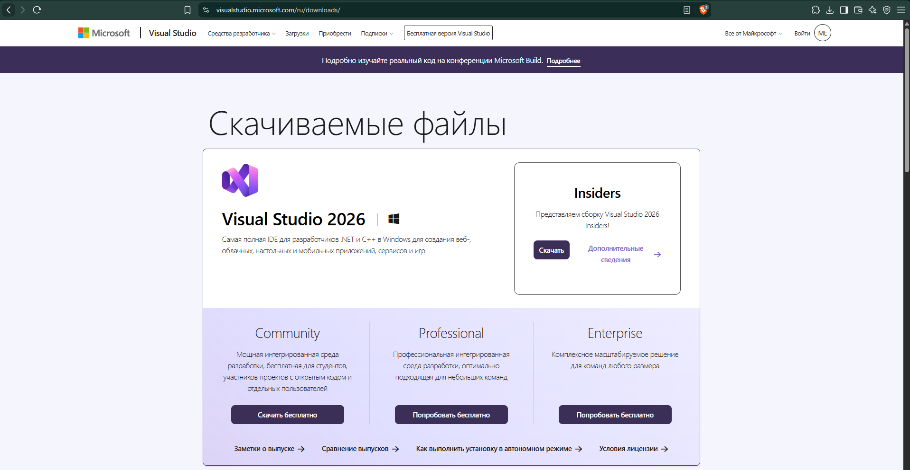
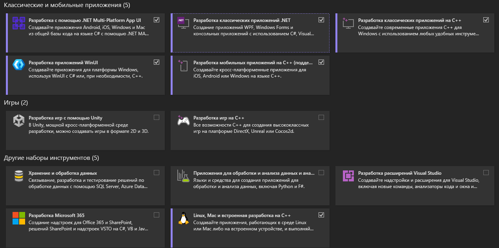
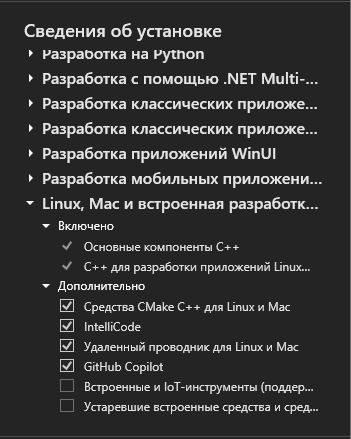
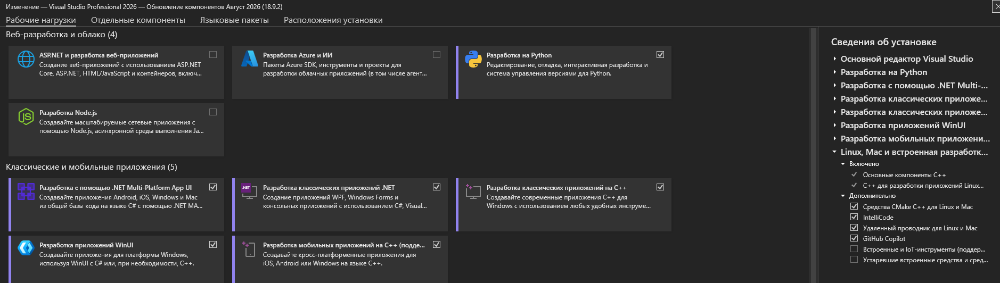

# 02. Установка Visual Studio 2022

[← Предыдущая](01-wsl2-installation.md) · [Содержание](../README.md) · [Следующая →](03-visual-studio-wsl2.md)

## 1. Загрузка установщика

1. Откройте [страницу Visual Studio](https://visualstudio.microsoft.com/downloads/).
2. Загрузите подходящую редакцию Visual Studio 2022. Для учебных и индивидуальных задач обычно подходит **Community**, с учётом её лицензионных условий.
3. Запустите `VisualStudioSetup.exe` и подтвердите запрос контроля учётных записей.

## 2. Выбор рабочей нагрузки

В Visual Studio Installer на вкладке **Рабочие нагрузки / Workloads** выберите:

- **Разработка классических приложений на C++ / Desktop development with C++**;
- **Разработка для Linux и встроенных систем на C++ / Linux and embedded development with C++** — если эта нагрузка доступна в используемой версии Installer.

## 3. Проверка отдельных компонентов

На вкладке **Отдельные компоненты / Individual components** найдите и отметьте:

- **C++ CMake tools for Linux** (в некоторых версиях название включает «and Mac»);
- CMake tools for Windows;
- MSVC C++ build tools;
- Windows SDK;
- средства подключения/отладки Linux, если они вынесены отдельно.

Ключевой компонент — **C++ CMake tools for Linux**: он нужен Visual Studio для обнаружения WSL-дистрибутивов.

## 4. Установка и проверка

1. Выберите режим загрузки и нажмите **Установить / Install**.
2. После завершения запустите Visual Studio.
3. Откройте **Help → About Microsoft Visual Studio** и зафиксируйте установленную версию.
4. В Installer нажмите **Modify** и убедитесь, что выбранные компоненты отмечены как установленные.

## Возможные проблемы

- **Нет шаблонов CMake:** повторно откройте Installer и добавьте CMake-компоненты.
- **Visual Studio не видит WSL:** проверьте `wsl -l -v`, наличие WSL2 и компонента C++ CMake tools for Linux.
- **Недостаточно места:** измените путь установки или освободите место до начала загрузки.

## Источники

- [Microsoft Learn — установка Visual Studio](https://learn.microsoft.com/visualstudio/install/install-visual-studio)
- [Microsoft Learn — подготовка Visual Studio для WSL2](https://learn.microsoft.com/cpp/build/walkthrough-build-debug-wsl2?view=msvc-170)

