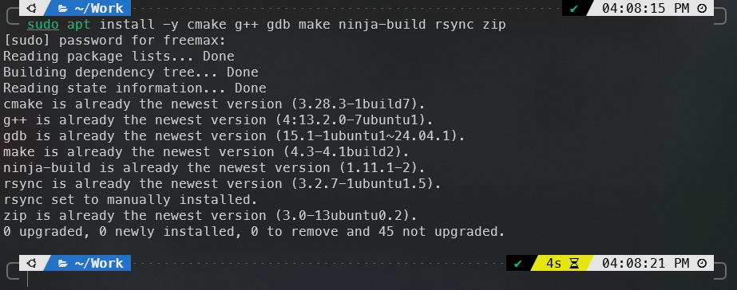
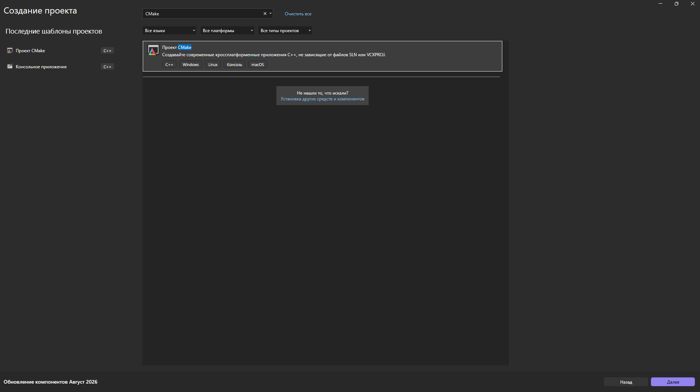
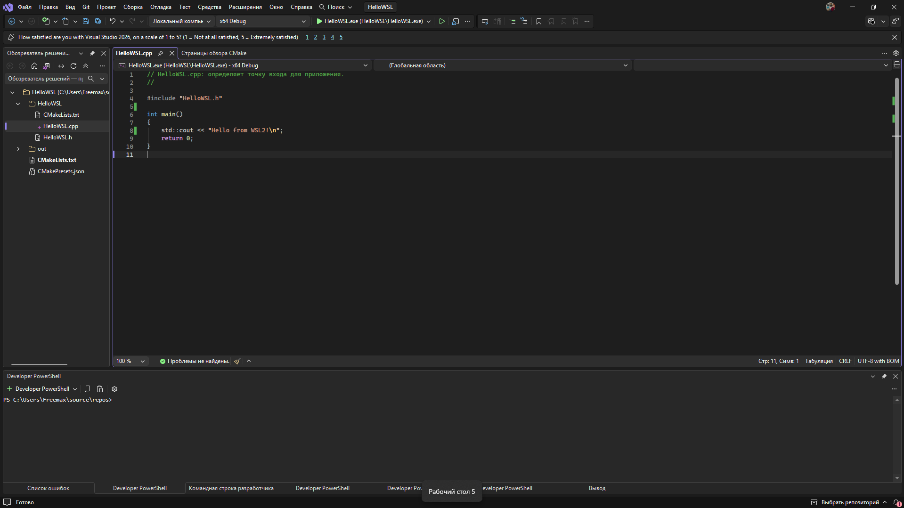
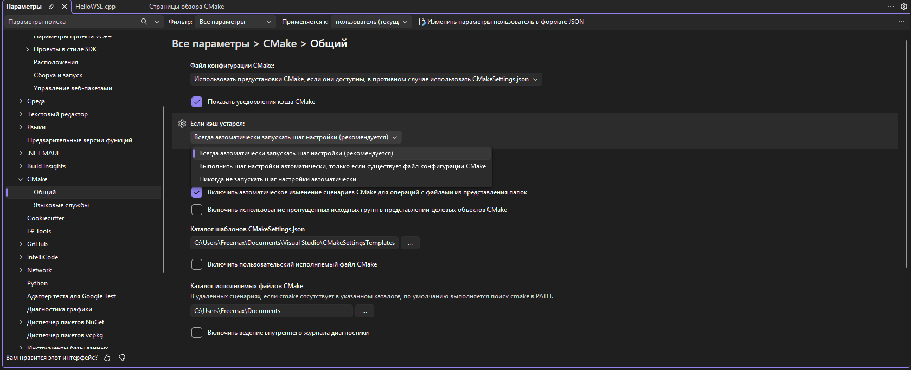
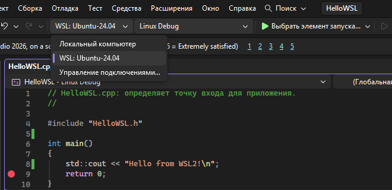
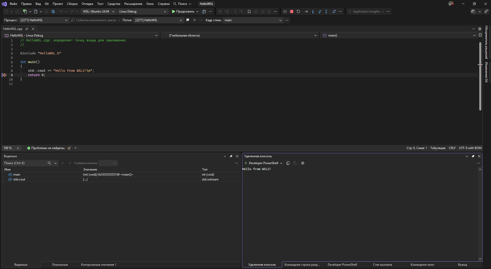

# 03. Интеграция Visual Studio с WSL2

[← Предыдущая](02-visual-studio-installation.md) · [Содержание](../README.md) · [Следующая →](04-clion-macos.md)

## 1. Установка Linux-инструментов

Откройте Ubuntu и выполните:

```bash
sudo apt update
sudo apt install -y cmake g++ gdb make ninja-build rsync zip
```

Проверьте:

```bash
cmake --version
g++ --version
gdb --version
ninja --version
```



## 2. Создание CMake-проекта

В Visual Studio выберите **Create a new project**, найдите шаблон **CMake Project**, задайте имя `HelloWSL`.



`CMakeLists.txt`:

```cmake
cmake_minimum_required(VERSION 3.20)
project(HelloWSL LANGUAGES CXX)

set(CMAKE_CXX_STANDARD 20)
set(CMAKE_CXX_STANDARD_REQUIRED ON)

add_executable(HelloWSL main.cpp)
```

`main.cpp`:

```cpp
#include <iostream>

int main()
{
    std::cout << "Hello from WSL2!\n";
    return 0;
}
```



## 3. Выбор WSL2 как цели

1. При необходимости включите CMake Presets: **Tools → Options → CMake → General**.

2. Закройте и снова откройте папку проекта, чтобы активировать интеграцию.
3. В левом списке целей на панели Visual Studio выберите `WSL2: Ubuntu`.
4. Выберите Linux configure preset и build preset.
5. Запустите конфигурацию проекта через **Project → Configure**.

Visual Studio может предложить развернуть совместимую версию CMake в WSL — подтвердите действие.



*Рисунок 2 — Ubuntu/WSL2 выбрана целевой системой*

## 4. Сборка и отладка

### 4.1 Краткое описание работы процесса сборки с помощью CMake

***CMake*** - система генерации файлов сборки.

В файле `CMakeLists.txt` описывается проект:

```
cmake_minimum_required(VERSION 3.20)

project(HelloApp LANGUAGES CXX)

set(CMAKE_CXX_STANDARD 20)

add_executable(HelloApp main.cpp)
```

Здесь:

- `cmake_minimum_required` — минимальная версия CMake;
- `project` — название проекта и используемый язык;
- `set` — требуемый стандарт C++;
- `add_executable` — какой исполняемый файл собрать и из каких исходников.

```
Исходный код + CMakeLists.txt
            ↓
          CMake
            ↓
 Ninja / Make / Visual Studio project
            ↓
         Компилятор
            ↓
     Исполняемый файл
```

Сборка выполняется в два этапа:

```
cmake -S . -B build
cmake --build build
```

Первая команда анализирует `CMakeLists.txt` и создаёт систему сборки в каталоге build. Вторая запускает Ninja, Make или другой генератор, который уже вызывает компилятор и линкер.

Итог: один `CMakeLists.txt` позволяет собирать проект разными инструментами и на разных ОС — например, через GCC в Linux, Clang в macOS или MSVC в Windows.

### 4.2 Настройка среды, сборка и отладка

1. Поставьте breakpoint на строке `return 0;`.
2. Выберите исполняемую цель `HelloWSL`.
3. Нажмите `F5` или **Debug → Start Debugging**.

Ожидаемый вывод:

```text
Hello from WSL2!
```

Отладчик должен остановиться на breakpoint, а процесс — выполняться внутри WSL2.



## Проверка среды

В Ubuntu можно убедиться, что исполняемый файл — Linux ELF:

```bash
file ~/.vs/HelloWSL/HelloWSL/HelloWSL.cpp
/home/freemax/.vs/HelloWSL/HelloWSL/HelloWSL.cpp: C source, Unicode text, UTF-8 (with BOM) text, with CRLF line terminators
```
Путь к build-каталогу виден в CMake Output Visual Studio.

## Возможные проблемы

- **Ubuntu отсутствует в Target System:** проверьте `wsl -l -v` и компонент C++ CMake tools for Linux.
- **Не найден `rsync`, `gdb` или `ninja`:** повторите установку пакетов из шага 1.
- **CMake cache содержит старую цель:** удалите CMake cache через меню Visual Studio и выполните Configure заново.
- **Проект хранится в WSL:** официальный сценарий Visual Studio предполагает исходники в Windows и автоматическое копирование в WSL через `rsync`.

## Источник

- [Microsoft Learn — Build and Debug C++ with WSL2 and Visual Studio 2022](https://learn.microsoft.com/cpp/build/walkthrough-build-debug-wsl2?view=msvc-170)

