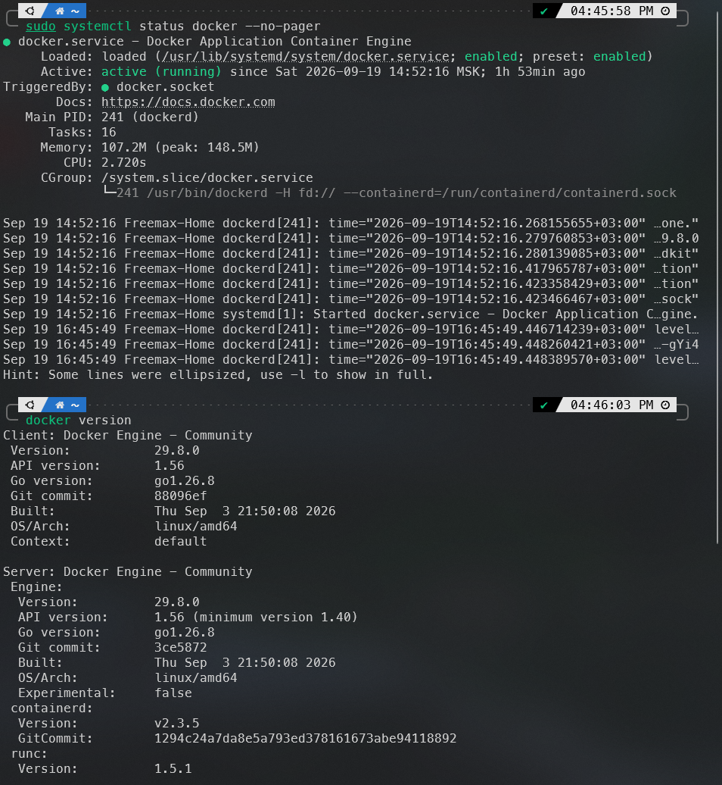

# 06. Установка Docker Engine в Ubuntu

[← Предыдущая](05-linux-vm-macos.md) · [Содержание](../README.md) · [Следующая →](07-mysql-docker.md)

## 1. Удаление конфликтующих пакетов

На чистой системе команда безопасно пропустит отсутствующие пакеты:

```bash
for pkg in docker.io docker-doc docker-compose docker-compose-v2 podman-docker containerd runc; do
  sudo apt-get remove -y "$pkg"
done
```

## 2. Добавление официального репозитория

```bash
sudo apt-get update
sudo apt-get install -y ca-certificates curl
sudo install -m 0755 -d /etc/apt/keyrings
sudo curl -fsSL https://download.docker.com/linux/ubuntu/gpg \
  -o /etc/apt/keyrings/docker.asc
sudo chmod a+r /etc/apt/keyrings/docker.asc
```

```bash
echo \
  "deb [arch=$(dpkg --print-architecture) signed-by=/etc/apt/keyrings/docker.asc] https://download.docker.com/linux/ubuntu \
  $(. /etc/os-release && echo "${UBUNTU_CODENAME:-$VERSION_CODENAME}") stable" | \
  sudo tee /etc/apt/sources.list.d/docker.list > /dev/null

sudo apt-get update
```
## 3. Установка

```bash
sudo apt-get install -y \
  docker-ce docker-ce-cli containerd.io \
  docker-buildx-plugin docker-compose-plugin
```

Проверьте сервис:

```bash
sudo systemctl status docker --no-pager
sudo docker run --rm hello-world
docker --version
docker compose version
```



## 4. Проверка Compose

```bash
mkdir -p ~/compose-check && cd ~/compose-check
```

Создайте временный `compose.yaml`:

```yaml
services:
  hello:
    image: hello-world:latest
```

Запустите и удалите тестовый проект:

```bash
docker compose up
docker compose down
```

## Особенности WSL2

- При установленном Docker Engine внутри Ubuntu команды выполняются самим Linux-демоном.
- Не устанавливайте одновременно несколько конкурирующих Docker-демонов без необходимости.
- Храните Linux-проекты в файловой системе WSL (`~/project`), а не в `/mnt/c`, если важна производительность операций с большим числом файлов.
- Если `systemctl` недоступен, проверьте актуальные настройки systemd для WSL; в современных WSL он поддерживается.

## Возможные проблемы

- **Permission denied для socket:** повторно войдите в сеанс после `usermod`, проверьте `groups`.
- **Пакет не найден:** проверьте кодовое имя Ubuntu и содержимое `/etc/apt/sources.list.d/docker.list`.
- **Демон не запущен:** `sudo systemctl enable --now docker`.
- **VM ARM64:** команда репозитория автоматически использует архитектуру из `dpkg --print-architecture`.

## Источники

- [Docker Docs — Install Docker Engine on Ubuntu](https://docs.docker.com/engine/install/ubuntu/)
- [Docker Docs — Linux post-installation steps](https://docs.docker.com/engine/install/linux-postinstall/)
