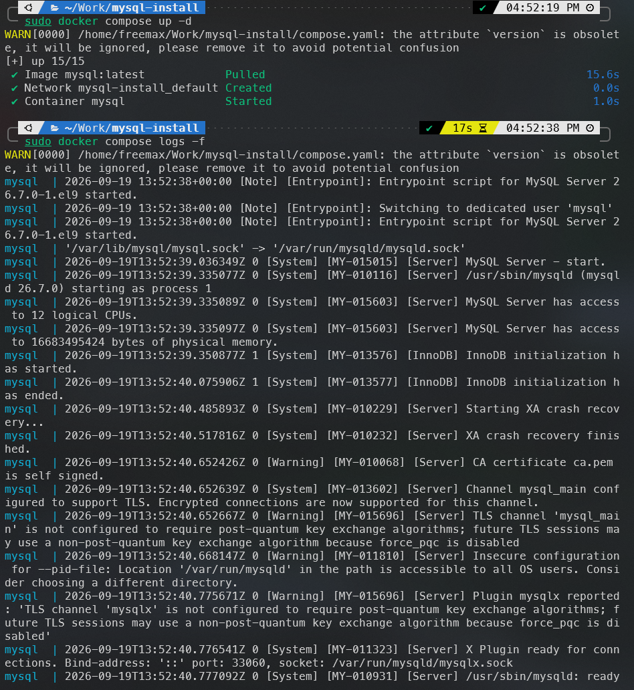
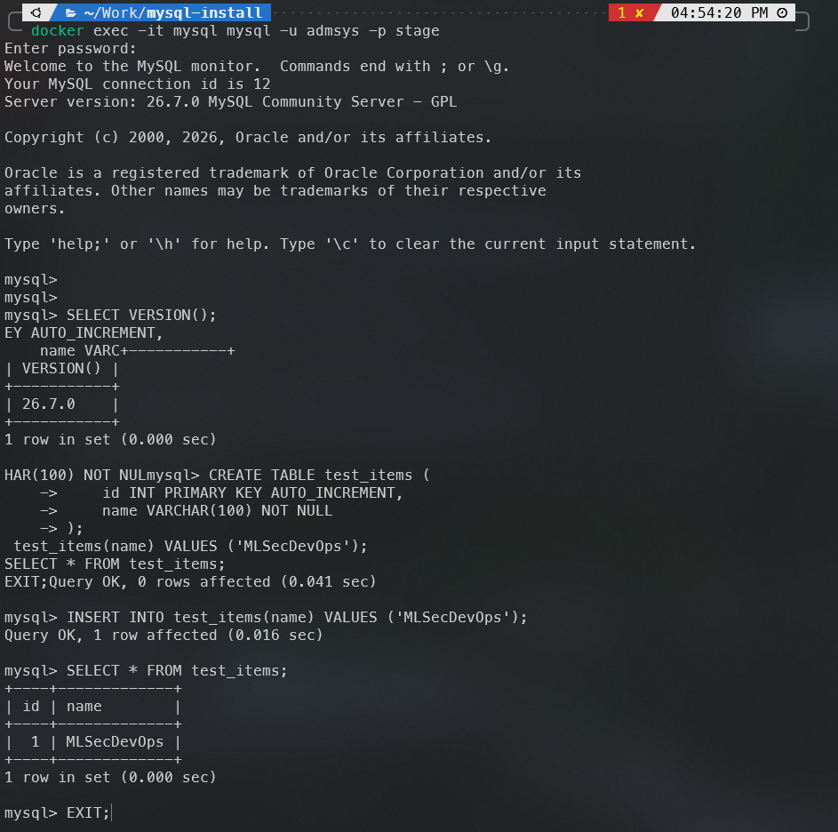

# 07. Запуск MySQL в Docker

[← Предыдущая](06-docker-linux.md) · [Содержание](../README.md) · [Следующая →](08-postgresql-docker.md)

## Цель

Запустить MySQL через Docker Compose, вынести секреты из Compose-файла и проверить подключение.

## 1. Подготовка

Из корня репозитория:

```bash
cd docker/mysql
cp .env.example .env
```

Откройте `.env` и задайте уникальные учебные пароли. Файл `.env` исключён из Git.

Структура:

```text
docker/mysql/
├── compose.yaml
├── .env.example
└── .env                 # локальный, не коммитить
```

## 2. Конфигурация

Готовый файл находится в [`docker/mysql/compose.yaml`](../docker/mysql/compose.yaml):

```yaml
services:
  mysql:
    image: mysql:latest
    container_name: mysql
    restart: unless-stopped
    ports:
      - "127.0.0.1:3306:3306"
    environment:
      MYSQL_ROOT_PASSWORD: ${MYSQL_ROOT_PASSWORD}
      MYSQL_DATABASE: stage
      MYSQL_USER: ${MYSQL_USER}
      MYSQL_PASSWORD: ${MYSQL_PASSWORD}
    volumes:
      - ./dbdata:/var/lib/mysql
    healthcheck:
      test: ["CMD-SHELL", "mysqladmin ping -h 127.0.0.1 -u root -p$$MYSQL_ROOT_PASSWORD --silent"]
      interval: 10s
      timeout: 5s
      retries: 10
      start_period: 30s
```

Привязка к `127.0.0.1` не публикует MySQL на всех сетевых интерфейсах хоста.

## 3. Проверка конфигурации и запуск

```bash
docker compose config
docker compose pull
docker compose up -d
docker compose ps
```

Первичная инициализация может занять некоторое время. Посмотрите логи:

```bash
docker compose logs -f mysql
```

Остановить просмотр: `Ctrl+C`.



## 4. Подключение и тест

```bash
docker exec -it mysql mysql -u "$MYSQL_USER" -p stage
```

Если переменная не экспортирована в текущую оболочку, укажите имя из `.env`, например:

```bash
docker exec -it mysql mysql -u stage_user -p stage
```

В MySQL:

```sql
SELECT VERSION();
CREATE TABLE test_items (
    id INT PRIMARY KEY AUTO_INCREMENT,
    name VARCHAR(100) NOT NULL
);
INSERT INTO test_items(name) VALUES ('MLSecDevOps');
SELECT * FROM test_items;
EXIT;
```



## 5. Управление

```bash
docker compose stop
docker compose start
docker compose down
```

`docker compose down` удаляет контейнер и сеть, но bind-mounted данные остаются в `./dbdata`.

Чтобы удалить данные и начать заново, сначала выполните `docker compose down`, затем вручную удалите **только** каталог `docker/mysql/dbdata`, убедившись, что данные больше не нужны.

## Важные замечания

- `latest` удобно для задания, но не гарантирует воспроизводимость. Для проекта зафиксируйте конкретный поддерживаемый тег.
- Переменные инициализации применяются только к пустому каталогу данных. Изменение `.env` не меняет уже созданных пользователей автоматически.
- Не используйте демонстрационные пароли и root-пользователя в приложении.

## Возможные проблемы

- **Порт занят:** найдите процесс через `sudo ss -ltnp | grep 3306` или измените левую часть порта.
- **Контейнер постоянно перезапускается:** изучите `docker compose logs mysql` и права на `dbdata`.
- **Новый пароль не применяется:** база уже инициализирована; измените пароль SQL-командой либо пересоздайте учебные данные осознанно.

## Источники

- [Docker Hub — официальный образ MySQL](https://hub.docker.com/_/mysql)
- [Docker Docs — Compose](https://docs.docker.com/compose/)

