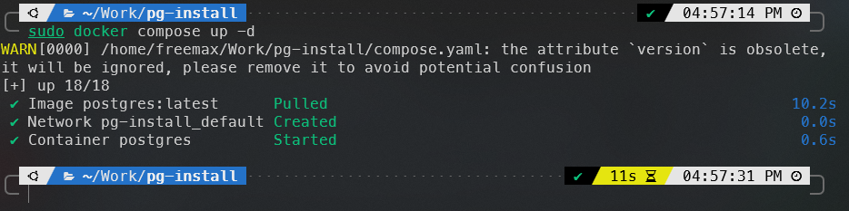
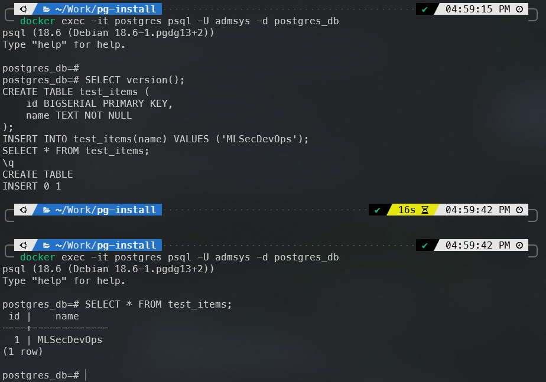

# 08. Запуск PostgreSQL в Docker

[← Предыдущая](07-mysql-docker.md) · [Содержание](../README.md)

## Цель

Запустить PostgreSQL через Docker Compose, проверить healthcheck, подключение и сохранение данных.

## 1. Подготовка

```bash
cd docker/postgres
cp .env.example .env
```

Измените пароль в `.env`. Не добавляйте этот файл в Git.

## 2. Конфигурация

Готовый файл: [`docker/postgres/compose.yaml`](../docker/postgres/compose.yaml).

```yaml
services:
  postgres:
    image: postgres:latest
    container_name: postgres
    restart: unless-stopped
    environment:
      POSTGRES_USER: ${POSTGRES_USER}
      POSTGRES_PASSWORD: ${POSTGRES_PASSWORD}
      POSTGRES_DB: postgres_db
      PGDATA: /var/lib/postgresql/data/pgdata
    ports:
      - "127.0.0.1:5430:5432"
    volumes:
      - ./pgdata:/var/lib/postgresql/data
    healthcheck:
      test: ["CMD-SHELL", "pg_isready -U $$POSTGRES_USER -d $$POSTGRES_DB"]
      interval: 30s
      timeout: 10s
      retries: 5
      start_period: 20s
    command:
      - postgres
      - -c
      - max_connections=1000
      - -c
      - shared_buffers=256MB
      - -c
      - effective_cache_size=768MB
      - -c
      - maintenance_work_mem=64MB
      - -c
      - checkpoint_completion_target=0.7
      - -c
      - wal_buffers=16MB
      - -c
      - default_statistics_target=100
    deploy:
      resources:
        limits:
          cpus: "0.50"
          memory: 1G
        reservations:
          cpus: "0.25"
          memory: 256M
```

## 3. Запуск

```bash
docker compose config
docker compose pull
docker compose up -d
docker compose ps
docker compose logs -f postgres
```



## 4. Подключение и тест

Подключитесь, используя имя пользователя из `.env`:

```bash
docker exec -it postgres psql -U postgres_user -d postgres_db
```

В `psql`:

```sql
SELECT version();
CREATE TABLE test_items (
    id BIGSERIAL PRIMARY KEY,
    name TEXT NOT NULL
);
INSERT INTO test_items(name) VALUES ('MLSecDevOps');
SELECT * FROM test_items;
\q
```

Проверка с хоста при установленном клиенте:

```bash
psql -h 127.0.0.1 -p 5430 -U postgres_user -d postgres_db
```



## 5. Проверка параметров

```bash
docker exec -it postgres psql -U postgres_user -d postgres_db \
  -c "SHOW max_connections;" \
  -c "SHOW shared_buffers;"
```

## 6. Управление и сохранность данных

```bash
docker compose stop
docker compose start
docker compose down
```

Данные сохраняются в `./pgdata`. Переменные `POSTGRES_*` инициализируют только пустой каталог данных. Изменение `.env` после первого запуска не пересоздаёт роль и базу.

## Возможные проблемы

- **Порт 5430 занят:** `sudo ss -ltnp | grep 5430`; измените host-порт при необходимости.
- **Healthcheck unhealthy:** проверьте совпадение имени пользователя/БД и `docker compose logs postgres`.
- **Container killed / OOM:** удалите агрессивный tuning, снизьте `max_connections` либо увеличьте доступную память.
- **Permission denied для `pgdata`:** проверьте владельца каталога и логи образа; не запускайте случайные рекурсивные `chmod 777`.

## Источники

- [Docker Hub — официальный образ PostgreSQL](https://hub.docker.com/_/postgres)
- [PostgreSQL — Server Configuration](https://www.postgresql.org/docs/current/runtime-config.html)
- [Docker Docs — Compose resource constraints](https://docs.docker.com/reference/compose-file/deploy/)

